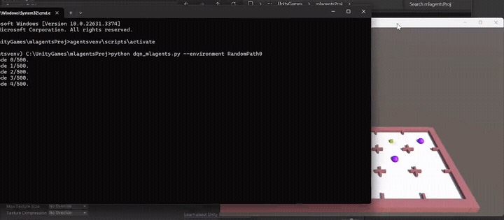
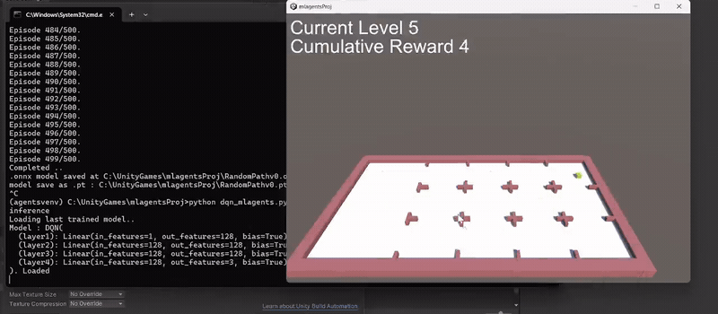
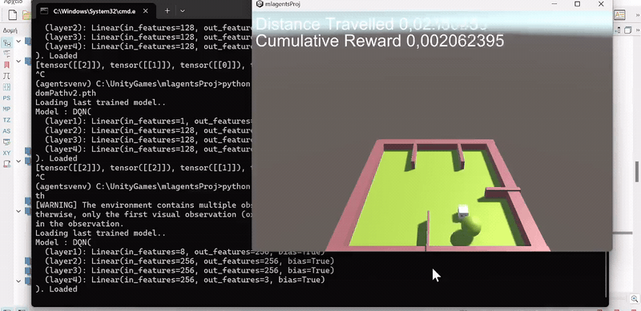
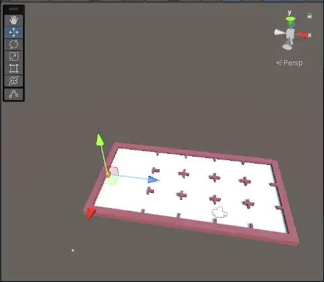
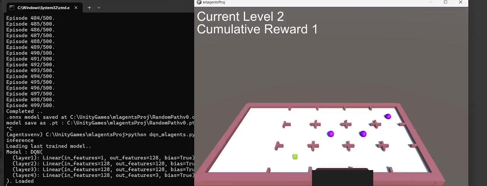
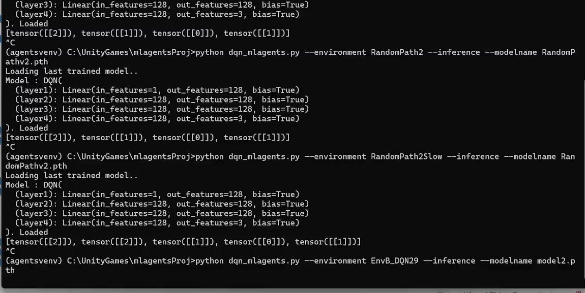
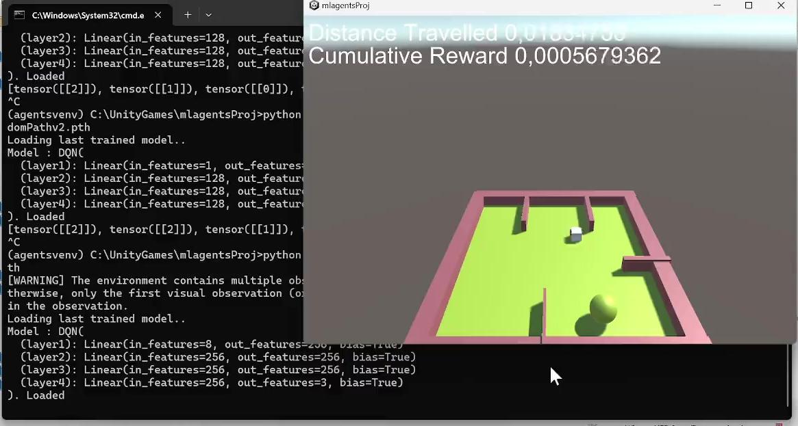

# Reinforcement Learning DQN with Unity ML-Agents — Project Report

> This report accompanies the code in this repository. It describes the
> environments, the DQN trainer, and the experiments used to study the agent's
> behaviour in deterministic and stochastic settings.

## Introduction

**The main goal of this project is to drive Unity ML-Agents from an external,
custom Python trainer** — training an agent by running a plain Python script
instead of invoking the built-in `mlagents-learn` command-line tool.

Out of the box, ML-Agents trains agents through its own CLI and its own
implementations of a small set of algorithms (PPO, SAC, etc.). That is
convenient, but it couples the training loop to the framework: you get the
algorithms ML-Agents ships, configured the way ML-Agents expects. By instead
connecting to the environment through the **Unity Gym wrapper**, the environment
becomes an ordinary `gym`-style object that any Python code can step. The
training loop, the network, the optimizer and the exploration policy all live in
user code — which means **any reinforcement-learning algorithm can be plugged in**,
not just the ones bundled with ML-Agents.

To demonstrate this, the project implements a **DQN** (Deep Q-Network) agent
entirely from scratch in PyTorch and uses it to train agents inside custom Unity
environments. DQN is not provided by ML-Agents' default trainers, so it is a
concrete example of the extra freedom the external-trainer approach unlocks; the
same harness would accept any other algorithm (REINFORCE, actor-critic
variants, custom research code, and so on).

A secondary goal is to study the resulting agent's behaviour — whether it
converges to the rational (reward-maximizing) policy — in both **deterministic**
and **stochastic** environments. The environments are kept simple, mainly
because training is CPU-bound and slow without GPU acceleration, and because the
focus is the training pipeline and convergence behaviour rather than raw scale.

The sections below describe how the environments and the DQN algorithm were
implemented, how the external trainer connects to Unity, how results are
evaluated, and how to run the agent in inference. Result figures from actual
training and inference runs are collected in the [Results](#results) section.

### Why an external trainer?

- **Algorithm freedom** — the training loop is ordinary Python, so any RL
  algorithm can be used, not only ML-Agents' built-ins.
- **Full control** — network architecture, replay buffer, optimizer, loss,
  exploration schedule and logging are all user code and can be modified freely.
- **Standard tooling** — because the environment is exposed as a Gym environment,
  the whole Python ecosystem (PyTorch, TensorBoard, etc.) applies directly.
- **Portability of results** — trained policies are exported to ONNX and can be
  dropped back into the Unity Editor for in-engine inference.

## Environment: RandomPathDQN

The environment consists of *levels*. In each level the player chooses one of
three positions to move to and proceed. Each level follows a probability
distribution that determines in which of the three positions a coin will spawn,
giving a reward to the player.

The player's objective is to collect as many coins as possible in a single run.
The environment is designed so that the per-level distribution can be set, some
probability of error can be added to the player's actions, and coins that
negatively impact the reward can be introduced (which the agent must learn to
avoid).

**Agent & Environment**

- **Actions:** 3 discrete actions to choose the position of the next level.
- **Observations:** the agent observes its location on the x-axis, corresponding
  to the current level.
- **Rewards:** +1 when the agent hits a coin.

The first example is a deterministic environment; the other two are stochastic.

### Implementing the environment

The environment is designed using Unity's primitive shapes, geometry/topology
tools and components (collision detection, rigidbody, tags, etc.) and Unity data
types (GameObjects). The agent GameObject has the following components:

- **BoxCollider, RigidBody** — Unity components that help detect collisions with
  coins.
- **Behavior Parameters and Decision Requester** — ML-Agents components that
  initialize the agent behaviour and communicate with the low-level ML-Agents
  API via protobuf.
- **`Agent412.cs`** — a C# script that implements and overrides functions of the
  ML-Agents `Agent` class and describes the interaction of the agent with the
  environment (observations, actions, rewards, environment functionality, etc.).

### `Agent412.cs` description

Serializable (editable from the Unity Editor) variables include:

- **coinPref** — a prefab of the coin GameObject, referenced when spawning.
- **Env** — the environment GameObject, used to correct topology issues.
- **stochastic_actions** — boolean. If true, then with probability 0.1 the agent
  moves to the position above the chosen action. For example, if `action_i = p2`
  then `Pr(action_i = p2) = 0.9`, `Pr(action_i = p1) = 0.1`; if `action_i = p1`
  then `Pr(action_i = p1) = 0.9`, `Pr(action_i = p3) = 0.1`.
- **distributions_list** — the list used to initialize the distribution of each
  level.

Functions implemented in `Agent412.cs`:

- `Initialize()` — initialize some topology of the environment.
- `OnEpisodeBegin()` — reset coins, agent and counters.
- `OnActionReceived()` — act in the environment based on the received action and
  the `stochastic_actions` flag.
- `CollectObservations()` — add observations via `sensor.AddObservation()`.
- `OnCollisionEnter()` — detect collisions with coins by tag: `Coin` →
  `AddReward(+1)`, `Prison` → `AddReward(-1)`.
- `Heuristic()` — test in heuristic mode whether actions work as expected.
- `RandomCoinSpawn()` — spawn coins according to the distributions list.
- `DestroyCoins()` — destroy remaining coins from previous episodes.
- `InitPossibleLocations()` — initialize coin locations relative to the agent's
  start position.
- `OnGUI()` — provide runtime information.

## DQN Algorithm & Custom Trainer (`dqn_mlagents.py`)

Once the Unity environment is built as a Unity project, the trainer implements
the DQN algorithm in `dqn_mlagents.py` using PyTorch, which provides easy
construction of neural networks, activation functions, optimizers, gradient
calculations, loss functions and backpropagation. The script also saves the
trained model as `.pth` and `.onnx`, supports running the agent in inference,
and plots reward and loss curves using TensorBoard.

ML-Agents provides built-in algorithms (such as PPO and A2C). DQN was
implemented from scratch here to gain familiarity with reinforcement learning
with function approximation, and because it is closely related to Q-learning.
Rather than intervening in the ML-Agents package via the low-level API, the
implementation uses the **Unity Gym Wrapper** to manage the environment with
plain Python libraries.

**Quick algorithm reference.** DQN is a Q-learning-with-approximation algorithm
that uses a neural network: the input layer receives the state (collected
observations) and the output is the state-action value for each possible action.
It is off-policy with an ε-greedy policy. It uses an experience-replay memory
from which batches are sampled randomly, and it performs iterative updates that
adjust Q-values using two neural networks (a **policy network** and a **target
network**). The target values change slowly, giving the policy network time to
adjust its weights toward a more stable target.

**`dqn_mlagents.py` components:**

- `class DQN` — a simple neural network: number of layers, neurons per layer,
  linear connections and ReLU activations.
- `class ReplayMemory` — basic replay memory used during training.
- `select_action()` — choose the next action with an ε-greedy policy.
- `training_loop()` — the agent interacts with the environment across multiple
  episodes; `env.step(action)` collects data into tensors, `optimize_model()` is
  called, and the target network is gradually updated.
- `optimize_model()` — once the memory holds at least one batch, sample randomly
  and compute:
  - Expected state-action values: `Q*(s,a,Θ⁻) = r + γ·maxₐ Q(s,a,Θ⁻)`
  - State-action values: `Q(s,a′,Θ)` for actions taken.
  - Loss: `HuberLoss(Q*(s,a,Θ⁻), Q(s,a′,Θ))`

  followed by gradient computation and backpropagation via `loss.backward()`,
  updating the policy network with the AdamW optimizer (gradient descent with
  weight regularization).

**Run command:** `python dqn_mlagents.py`

**Save & inference.** The trainer saves the final model as both `.pth` and
`.onnx`:

- **ONNX** files can be dropped into a Unity project for inference (Behavior
  Parameters → Model) to check the agent's behaviour in simulation. Exported
  ONNX models must match the form expected by ML-Agents; this is handled by
  `class WrapperNet` and `save_model_onnx()`.
- **`.pth`** is the default PyTorch format. Running the script with the
  `--inference` flag starts the agent in inference mode using the last trained
  model.

**Run command:** `python dqn_mlagents.py --inference`

**Plots.** Using `torch.utils.tensorboard` and matplotlib, reward/episode and
loss/episode plots are stored under the `runs` directory (`plot_reward`
function). Run `tensorboard --logdir="runs"` and open localhost in a browser.

Other flags (`python dqn_mlagents.py -h`):

- **Training:** `--environment` (built folder), `--num` (number of episodes,
  default 500), `--n256` to use 256 neurons per layer for the second
  environment.
- **Inference:** `--inference`, `--environment`, `--modelname`.

## RandomPath: Training & Inference

Workflow:

1. Build the Unity project into a folder, e.g. `BuildFolderName`.
2. Open a terminal and activate a virtual environment in the same path as the
   built folder.
3. Train: `python dqn_mlagents.py --environment "BuildFolderName"`.
4. Two model files are generated: `model.onnx` and `model.pth`.
5. Use `model.pth` for inference via the trainer:
   `python dqn_mlagents.py --environment "BuildFolderName" --modelname "model.pth" --inference`.
6. Use `model.onnx` for inference via the Unity Editor.

**RandomPath0 (deterministic).** With `tensor[0] ⇒ mid`, `tensor[2] ⇒ bot`,
`tensor[1] ⇒ up`, the first action does not affect the result, and the strategy
**bot, mid, mid, top** maximizes the reward.

**RandomPath1 (stochastic).**

- Level 1: 100% bot
- Level 2: 80% top, 20% mid
- Level 3: 60% mid, 20% top, 20% bot
- Level 4: 30% bot, 50% top, 20% mid
- Model: `RandomPathv1.pth`

Trained for 4000 episodes, the agent's strategy is **[bot, top, mid, top]**, the
strategy that maximizes the expected reward. This example needs many more
episodes to reliably find the rational strategy.

**RandomPath2 / RandomPath2Slow (stochastic + negative coin).**

- Uses stochastic actions and a negative coin.
- Model: `RandomPathv2.pth`

Trained for 4000 episodes, the agent's strategy is **[bot, top, mid, top]**
(optimal). For the level with the negative (red) coin:

```
E[reward | a_i = mid] = 1·Pr(coin spawns mid)·Pr(a_i correct) − 1·Pr(a_i wrong)
                      = 0.8·0.9 − 0.1 = 0.62
E[reward | a_i = bot] = 0.2·0.9 + 0.8·0.1 = 0.26
```

Therefore `utility(a_i = mid) > utility(a_i = bot)` at level 3.

As the number of episodes increases, the agent converges to the rational
strategy π*. For larger action/state spaces, increasing the batch size and
decreasing `EPS_DECAY` (to increase exploration) can also help.

### RandomPath — results (animated)

Training the RandomPath agent by launching the external Python trainer
(`python dqn_mlagents.py --environment ...`), with episodes counting up in the
console while the environment runs:



The trained RandomPath agent running in inference in the Unity build, collecting
coins and accumulating reward level by level:



## A Coin in the Room

A second environment was designed where a neural network becomes more useful as
the complexity of the observations increases.

**Agent & Environment**

- **Actions:** 3 discrete actions (don't turn, turn +45°, turn −45°); the agent
  always moves forward.
- **Observations:** the agent observes its location in the plane `x, z ∈ ℝ²`.
  Using Unity's SphereCasting, 3 ray sensors are built (without error); each
  sensor reports what it senses (Coin or Wall) and the distance to it (2
  observations per sensor). Total: 2 × 3 + 2 = **8 observations**.
- **Rewards:** +2 when the agent hits a coin, −1 when it hits a wall (we don't
  want to punish walls as much as −2). A small reward proportional to distance
  travelled (`distanceTravelled / 1000`) motivates the agent to explore and
  avoid turning in circles.
- There are 4 locations where a coin spawns uniformly at random.

The same `dqn_mlagents.py` trainer was used. The agent is implemented in
`Agent412p3.cs`; the main difference is the sensor implementation in the
`Update()` function. During execution the `--n256` flag is used to employ 256
neurons per layer.

- **Inference run command:**
  `python dqn_mlagents.py --environment EnvB_DQN29 --inference --modelname model2.pth`
- Environment name: `EnvB_DQN29`; trained model: `model2.pth`, trained for 3000
  episodes.

**Plots.** All plots are saved with TensorBoard under `runs`. The mean-reward
plot is somewhat unstable but increases roughly logarithmically; the loss plot
increases as training progresses.

### Coin in the Room — results (animated)

The trained agent navigating the room in inference: steering with its ray
sensors toward the coin while avoiding the walls (the overlay shows distance
travelled and cumulative reward):



## Results

The figures below are captured from real training and inference runs. They show
the external Python trainer driving Unity end to end: building/stepping the
environment, training the DQN network, and running the trained policy back in the
Unity build.

### Environment design (RandomPath)

The RandomPath environment as authored in the Unity Editor: a level-based board
where, at each level, a coin spawns in one of three positions according to a
per-level probability distribution. The agent (transform gizmo, left) chooses one
position per level to maximize collected reward.



### Training and inference (RandomPath)

A single view of the whole pipeline. **Left:** the external trainer's console
output — the DQN training loop running to completion (`Episode 499/500`,
`Completed`), saving the policy to `.onnx` and `.pth`, and then re-launching in
`--inference` mode with the loaded `DQN(...)` architecture. **Right:** the Unity
build running the trained agent, with the in-game overlay showing the current
level and cumulative reward.



### Running the external trainer from the command line

The core of the project: the agent is trained and evaluated by invoking a plain
Python script — for example
`python dqn_mlagents.py --environment RandomPath2 --inference --modelname RandomPathv2.pth`
— rather than the ML-Agents CLI. Each run loads the DQN network and prints the
policy the agent follows as a sequence of action tensors (e.g.
`[tensor([[2]]), tensor([[1]]), tensor([[0]]), tensor([[1]])]` → `bot, top, mid,
top`), which matches the reward-maximizing strategy for that environment.



### Inference in the "Coin in the Room" environment

The second environment exercises the neural network with richer observations.
**Right:** the 3D room with walls, the agent (white cube) and a coin (yellow
sphere), plus the overlay reporting distance travelled and cumulative reward.
**Left:** the trainer console showing the larger network for this task —
`in_features=8` (the eight ray-sensor observations) into `256`-neuron layers —
being loaded for inference.



> The still frames above are drawn from screen recordings of the training and
> inference sessions. They are meant to document the pipeline and the learned
> behaviour; exact reward values will vary between runs.

## Versions Overview

- **OS:** Windows 11
- **Unity:** 2022.3.12f1
- **ML-Agents Unity package:** 2.0.1 (installed via Unity Package Manager)
- **ml-agents (Python):** 1.0.0 (see `requirementsDQN.txt`)
- **Python:** 3.10.3 (important for this ML-Agents version)

## References

- Mnih et al., *Human-level control through deep reinforcement learning*, Nature
  (https://www.nature.com/articles/nature14236)
- F. AlMahamid and K. Grolinger, *Reinforcement Learning Algorithms: An Overview
  and Classification*, IEEE.
- *Unity: A General Platform for Intelligent Agents*
  (https://arxiv.org/abs/1809.02627)
- ML-Agents documentation:
  https://unity-technologies.github.io/ml-agents/ML-Agents-Toolkit-Documentation/
- PyTorch tutorials: https://pytorch.org/tutorials/
